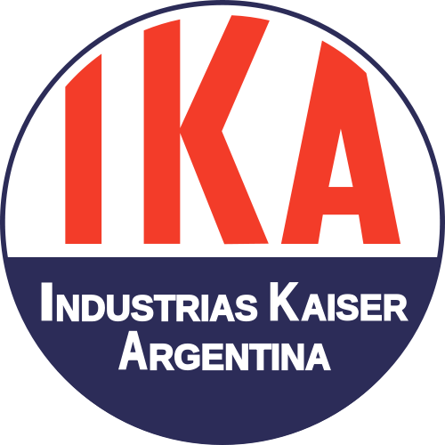

# Grupo 2 Consesionaria Industrias Kaiser Argentina   

## Descripcion 
La pagina industriasKaiserArgentina y Renault (desde 1956 hasta el 1995) se dedicara a la venta de autos de la misma empresa. 

## A que publico apunta la pagina 
Amantes de la nostalgia y el automovilismo nacional argentino. 

## Descripcion de los integrantes: 

### Thomás Manzone: Tengo 19 años, soy un entusiasta de la informatica y la computacion, y tengo pasion tanto por el back como por el front end.

### Sebastian Velazquez: edad 28 años, dueño de negocio de vinos, almacen y quiosco. Mi objetivo es dedicarme a la programación. Me gusta mas el Back-End.

### Franco Sanchez: tengo 26 años, mi objetivo es aprender y ejercer sobre el mundo de la programacion, tengo un negocio familiar "almacen".

### Mauro Sanchez: mi edad es 28. Vengo con ganas de unirme, solucionar problemas y aprender lo maximo en el mundo de la programacion. 

##  Listado de  referentes:
   + [Rosario_Garage](https://www.rosariogarage.com/)
   + [Chevrolet](https://www.chevrolet.com.ar/)
   + [Ford](https://www.giorgiford.com/home.html)
   + [Toyota](https://www.toyota.com.ar/)
   + [Lamborghini](https://www.lamborghini.com/es-en)

### Colores
### Celeste, Blanco y Amarillo.

### Plataformas que utilizadas para organizar el trabajo:
  + [GitHub](https://github.com/Sebastian-Velazquez/grupo_2_concesionaria)

  + [Trello](https://trello.com/invite/espaciodetrabajo81835235/ATTIe9bc5cfe0e113e41ef305441279bf31e804319F2)
  
  + [Link onRender](https://consesionaria-ika-torino.onrender.com/)

### Metodología:
 
   1. Comenzar a hacer.
   2. Hacer más.
   3. Continuar haciendo.
   4. Hacer menos.
   5. Dejar de hacer.
